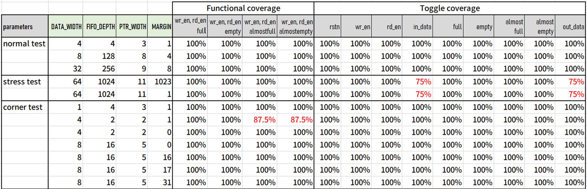
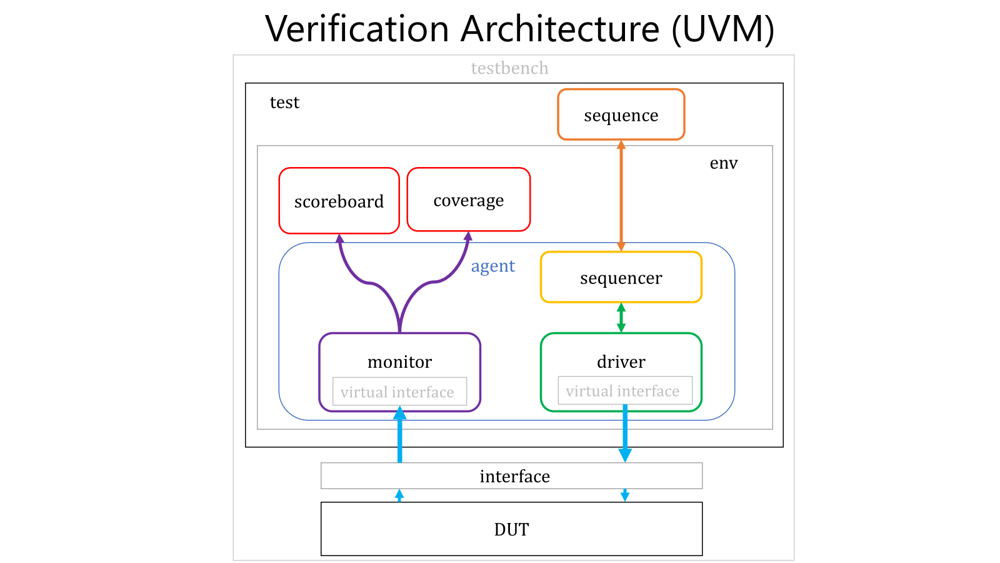
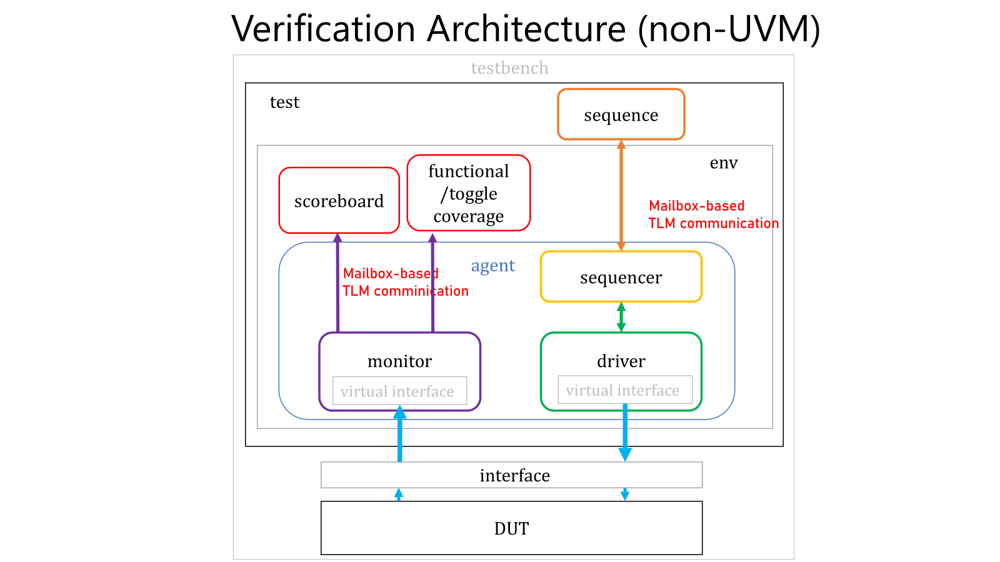

# Verification of Sync FIFO (UVM-like Architecture)

This project demonstrates a custom **UVM-like verification environment** for verifying a **synchronous FIFO** design, built entirely with **native SystemVerilog** (without `uvm_pkg`) and run on **ModelSim Starter Edition**.

---

## Key Features

- **Custom UVM-like Verification Environment**  
  Developed a modular, object-oriented testbench from scratch using native SystemVerilog, including custom implementations of key UVM components.

- **Mailbox-based TLM Communication**  
  Implemented `Sequence ⇄ Sequencer ⇄ Driver` and `Monitor ⇄ Scoreboard` connections via SystemVerilog `mailbox`, enabling robust transaction flow and TLM-style decoupling between components.

- **Golden Reference Model**  
  Emulated FIFO behavior in the scoreboard using SystemVerilog queue, supporting cycle-accurate result tracking and reference modeling.

- **Virtual Interface**  
  Applied `virtual interface` for structured and maintainable testbench–DUT connections.

- **Assertion-Based Verification**  
  Integrated SystemVerilog `assertion` checks to validate data integrity and protocol correctness.

- **Functional & Toggle Coverage**  
  Implemented custom coverage logic:
  - Functional coverage with **illegal bins** detection.  
  - Interface **toggle coverage**.  
  All using native SystemVerilog (no commercial coverage tools).

---
## Verification results

<!-- <div style="font-size: 6px">

| parameters     | DATA_WIDTH | FIFO_DEPTH | PTR_WIDTH | MARGIN |        **Functional** |**coverage**        |        |        |        |       **Toggle**| **coverage**        |       |       |       |       |       |              |                       
|----------------|------------|------------|-----------|--------|---------------------------------------|--------|--------|--------|----------------------------------|-------|-------|-------|-------|-------|--------------|----------------|----------|
|                |            |            |           |        | wr_en, rd_en, full | wr_en, rd_en, empty | wr_en, rd_en, almostfull | wr_en, rd_en almostempty | rstn  | wr_en | rd_en | in_data | full  | empty | almost full | almost empty  | out_data |
| **normal test** |            |            |           |        |                   |                    |                         |                          |       |       |       |         |       |       |             |               |          |
|                | 4          | 4          | 3         | 1      | 100%              | 100%               | 100%                    | 100%                     | 100%  | 100%  | 100%  | 100%    | 100%  | 100%  | 100%        | 100%          | 100%     |
|                | 8          | 128        | 8         | 4      | 100%              | 100%               | 100%                    | 100%                     | 100%  | 100%  | 100%  | 100%    | 100%  | 100%  | 100%        | 100%          | 100%     |
|                | 32         | 256        | 9         | 8      | 100%              | 100%               | 100%                    | 100%                     | 100%  | 100%  | 100%  | 100%    | 100%  | 100%  | 100%        | 100%          | 100%     |
| **stress test** |            |            |           |        |                   |                    |                         |                          |       |       |       |         |       |       |             |               |          |
|                | 64         | 1024       | 11        | 1023   | 100%              | 100%               | 100%                    | 100%                     | 100%  | 100%  | 100%  | **75%** | 100%  | 100%  | 100%        | 100%          | **75%**  |
|                | 64         | 1024       | 11        | 1      | 100%              | 100%               | 100%                    | 100%                     | 100%  | 100%  | 100%  | **75%** | 100%  | 100%  | 100%        | 100%          | **75%**  |
| **corner test** |            |            |           |        |                   |                    |                         |                          |       |       |       |         |       |       |             |               |          |
|                | 1          | 4          | 3         | 1      | 100%              | 100%               | 100%                    | 100%                     | 100%  | 100%  | 100%  | 100%    | 100%  | 100%  | 100%        | 100%          | 100%     |
|                | 4          | 2          | 2         | 1      | 100%              | 100%               | **87.5%**               | **87.5%**                | 100%  | 100%  | 100%  | 100%    | 100%  | 100%  | 100%        | 100%          | 100%     |
|                | 4          | 2          | 2         | 0      | 100%              | 100%               | 100%                    | 100%                     | 100%  | 100%  | 100%  | 100%    | 100%  | 100%  | 100%        | 100%          | 100%     |
|                | 8          | 16         | 5         | 0      | 100%              | 100%               | 100

</div> -->



> <div style="font-size: 6px">

> - For FIFO depth = 2 with almost full/empty threshold = 1 :  
>   - When the FIFO is **full**, only **read** operations are allowed, so both `almost_full` and `almost_empty` signals are asserted.  
>   - When the FIFO is **empty**, only **write** operations are allowed, so both `almost_full` and `almost_empty` signals are asserted.  
>
> - For DATA_WIDTH = 64, achieving 100% coverage would require exploring all 2^64 possible input values, which is infeasible.

> </div>


<!-- --- -->
<!--  -->
---


---


## Requirements
 
- [ModelSim Starter Edition](https://eda.sw.siemens.com/en-US/ic/modelsim/) (Free)

### Note about ModelSim Starter Edition
The free **Starter Edition** does **not** support:
- SystemVerilog **randomization**
- SystemVerilog **coverage**
- SystemVerilog **property**
- Full **UVM** library

This project bypasses those limitations by implementing a custom UVM-like structure **without relying on `uvm_pkg`**.

---

## Run Simulation

```bash
./run_modelsim.sh
